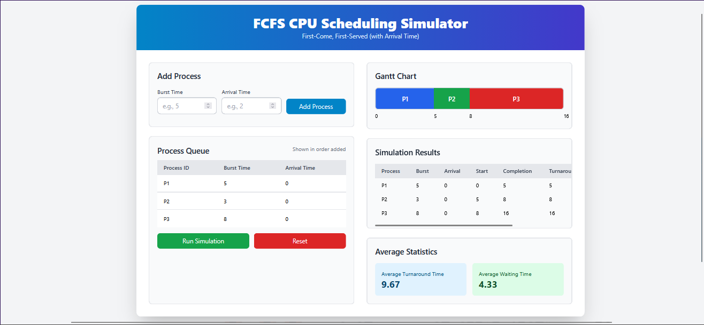
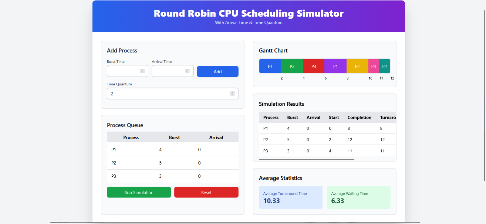

# 🖥️ OS CPU Scheduling Simulator  
### Visual & Interactive CPU Scheduling Algorithms for Operating Systems

### 🔗 Live Demo  
👉 **https://os-cpu-scheduling-simulator.vercel.app**

## 📌 Overview
This project provides an **interactive web-based simulation** of Operating System CPU Scheduling Algorithms.  
It helps students and educators **visualize process execution**, understand scheduling decisions, and compare algorithm performance.

---

## 🚀 Features  
✔ Visual Gantt Charts  
✔ Waiting Time & Turnaround Time calculation  
✔ Supports **FCFS**, **SJF**, and **Round Robin**  
✔ Interactive UI with input forms  
✔ TailwindCSS-powered modern styling  
✔ No backend required — 100% client-side  
✔ Fast and lightweight  

---

## 📊 Supported Algorithms

| Algorithm       | Preemptive | Non-Preemptive | Arrival Time Support | Time Quantum | Priority Support | Difficulty Level |
| --------------- | ---------- | -------------- | -------------------- | ------------ | ---------------- | ---------------- |
| FCFS            | ❌          | ✔              | ✔                    | ❌            | ❌                | ⭐                |
| SJF             | ❌          | ✔              | ✔                    | ❌            | ❌                | ⭐⭐               |
| SJTR / SRTF | ✔          | ❌              | ✔                    | ❌            | ❌                | ⭐⭐⭐⭐             |
| Priority        | ✔ / ❌      | ✔ / ❌          | ✔                    | ❌            | ✔                | ⭐⭐⭐              |
| Round Robin     | ✔          | ❌              | ✔                    | ✔            | ❌                | ⭐⭐⭐              |
---

## 🖼️ Screenshots (You can replace these with real images)

### 🔹 FCFS Simulator  

### 🔹 SJF Simulator  

### 🔹SJTR Simulator

### 🔹PRIORITY Simulator

### 🔹 Round Robin Simulator  

---
